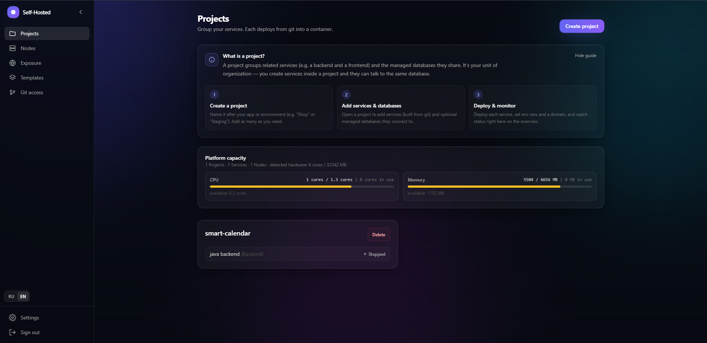
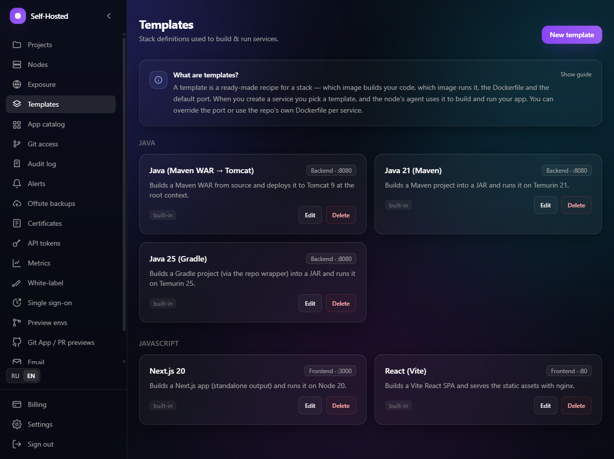
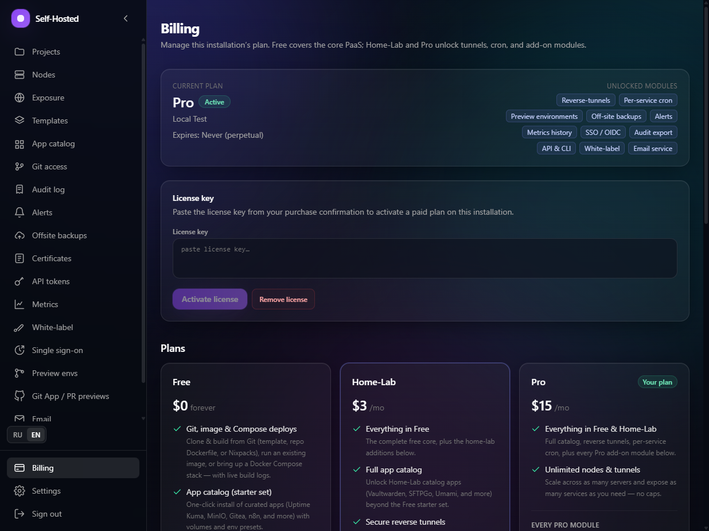

<div align="center">


# Self-Hosted PaaS

**Deploy apps from Git to Docker on your own servers — a modern, self-hosted alternative to Heroku/Vercel.**

[](https://github.com/KROWIEL/self-hosted-public/actions/workflows/ci.yml)
[](LICENSE)
[](https://nestjs.com)
[](https://nextjs.org)
[](https://go.dev)
[](https://www.docker.com)
[](#contributing)

**🌐 Language:** [English](#english) · [Русский](#русский)

</div>

---

## English

> Open-core, self-hosted platform to deploy backends and frontends straight from Git into Docker — with managed databases, HTTPS, multi-tenant projects, RBAC, 2FA, live logs & metrics, backups, and reverse tunnels for home-lab / NAT nodes.

### ✨ Features

- **Git-to-Docker deploys** — build & run services from a repo with isolated build steps and one-click redeploys.
- **Stack templates** — curated, editable templates (Java, Node/Next.js, …) grouped by category; create your own.
- **Managed databases** — provision Postgres/MySQL per project, with scheduled backups & restore.
- **Zero-downtime releases** — blue-green deploys with health-gating.
- **Multi-tenant projects + quotas** — CPU/RAM limits per project.
- **RBAC** — `OWNER / ADMIN / MEMBER / VIEWER` roles, plus an append-only audit log.
- **Accounts & security** — two-stage registration, TOTP 2FA, strict password policy, soft-forced rotation of weak passwords.
- **Nodes** — run the Go agent on any server; local dev agent, remote self-enrollment with TLS pinning & heartbeats.
- **Reverse tunnels** — expose NAT / home-lab nodes to the internet through a lightweight public relay *(Home-Lab / Pro module)*.
- **Live logs, metrics & web exec** — real-time container logs, resource usage, and an in-browser terminal.
- **Automatic HTTPS** — Traefik + Let's Encrypt (HTTP-01 or DNS-01 wildcard).
- **Localized UI** — English & Russian out of the box.

### 📸 Screenshots

|  |  |
|---|---|
|  |  |
|  |  |
|  |  |

> Live demo & walkthrough GIF coming soon.

### 🚀 Quick start

**Prerequisites:** Docker + Docker Compose, Node.js ≥ 20, and (for building agents) Go ≥ 1.24.

```bash
git clone https://github.com/KROWIEL/self-hosted-public.git
cd self-hosted-public
cp .env.example .env          # then edit secrets (see below)
npm install
```

Generate real secrets before first run:

```bash
# 32-byte base64 key for AES-256-GCM (secrets at rest)
openssl rand -base64 32       # -> ENCRYPTION_KEY
openssl rand -base64 48       # -> JWT_SECRET / JWT_REFRESH_SECRET
```

Boot the stack (Windows PowerShell):

```powershell
./start.ps1
```

…or manually:

```bash
docker compose up -d postgres redis   # infra
npm run db:push                        # apply schema
npm run db:seed                        # seed the first admin
npm run dev:cp                         # control-plane API  -> :3001
npm run dev:web                        # web UI            -> :3000
```

Open **http://localhost:3000** and sign in with the seeded admin.

### 🧩 Tiers & pricing

Open-core: the **core is free forever and unlimited**. Paid tiers unlock add-on
modules via a single signed license key — activate it under **Billing → License
key** (admin) or set `LICENSE_KEY`. One key upgrades the whole instance; the
core has no per-seat metering.

| Tier | Price* | What you get |
|------|--------|--------------|
| **Free** | $0 forever | The complete core (see below) |
| **Home-Lab** | ~$3 / mo | Core **+ Reverse tunnels** module |
| **Pro** | ~$15 / mo | Core **+ every module** (all 9 below) |

<sub>*Suggested pricing — you set the final numbers in your own store. Details in [`docs/LICENSING.md`](docs/LICENSING.md).</sub>

**The free core includes:** git-to-Docker deploys, stack templates, automatic
HTTPS, managed Postgres/MySQL with backups, multi-tenant projects & quotas,
RBAC, 2FA, live logs / metrics / web-exec, unlimited nodes, and a localized
(EN/RU) UI.

#### Add-on modules

| Module | From tier | What it does |
|--------|-----------|--------------|
| **Reverse tunnels** (`reverse-tunnels`) | Home-Lab | Expose services on NAT / home-lab nodes to the internet through a lightweight public relay. |
| **Preview environments** (`preview-envs`) | Pro | Deploy any branch as a disposable, isolated copy with its own optional subdomain; auto-torn down by TTL. Ideal for PR review. |
| **Off-site backups** (`offsite-backups`) | Pro | Mirror managed-database backups to any S3-compatible bucket, with encrypted credentials. |
| **Alerts** (`alerts`) | Pro | Webhook alerts for node-offline, deploy-failed, backup-failed and resource thresholds, via configurable channels & rules. |
| **Metrics history** (`metrics-history`) | Pro | Collect and chart historical CPU / RAM / disk usage per node. |
| **SSO / OIDC** (`sso`) | Pro | OpenID Connect single sign-on (Google, Entra, Okta, Keycloak…) with a domain allow-list and just-in-time user provisioning. |
| **Audit export** (`audit-export`) | Pro | Organization-wide audit log with filters and CSV / JSON export. |
| **API & CLI tokens** (`api-cli`) | Pro | Personal access tokens (PATs) for programmatic access to the API / CLI. |
| **White-label** (`white-label`) | Pro | Customize the app name, logo, accent color and attribution. |

<sub>All modules are implemented and shipping. Home-Lab unlocks Reverse tunnels; Pro unlocks everything.</sub>

### 🏗️ Architecture

- **`apps/control-plane`** — NestJS API (auth, RBAC, deploy orchestration, licensing, audit).
- **`apps/web`** — Next.js 14 dashboard (localized).
- **`services/agent`** — Go daemon per node (builds, runs containers, health, logs, tunnels).
- **`packages/shared`** — shared TypeScript contracts.
- **Infra** — PostgreSQL, Redis (BullMQ), Traefik via `docker-compose.yml`.

### 🔐 Security

- Secrets (PATs, env secrets, tokens) encrypted at rest (AES-256-GCM).
- JWT sessions, TOTP 2FA, strict password policy.
- Per-project RBAC + append-only audit log.
- TLS pinning for remote agents.

Never commit your `.env` or private keys — see the bundled `gitleaks` pre-commit hook (`git config core.hooksPath .githooks`).

### 🤝 Contributing

Issues and PRs are welcome. By contributing you agree your changes are licensed under the Elastic License 2.0.

### 📄 License

Source-available under the [Elastic License 2.0](LICENSE): use, copy, modify and self-host freely. You may **not** provide the software to third parties as a managed/hosted service, and you may **not** remove or circumvent the license-key functionality. A commercial license key unlocks paid modules — see [`docs/LICENSING.md`](docs/LICENSING.md).

---

## Русский

> Open-core платформа для self-hosting: деплой бэкендов и фронтендов прямо из Git в Docker — с managed-базами, HTTPS, мульти-тенант проектами, RBAC, 2FA, live-логами и метриками, бэкапами и обратными туннелями для home-lab / NAT-нод.

### ✨ Возможности

- **Деплой Git → Docker** — сборка и запуск сервисов из репозитория с изолированным шагом сборки и редеплоем в один клик.
- **Шаблоны стеков** — готовые редактируемые шаблоны (Java, Node/Next.js, …) по категориям; можно создавать свои.
- **Managed-базы** — Postgres/MySQL на проект, с бэкапами по расписанию и восстановлением.
- **Zero-downtime релизы** — blue-green деплой с проверкой health.
- **Мульти-тенант проекты + квоты** — лимиты CPU/RAM на проект.
- **RBAC** — роли `OWNER / ADMIN / MEMBER / VIEWER` и append-only аудит-лог.
- **Аккаунты и безопасность** — двухэтапная регистрация, TOTP 2FA, строгая парольная политика, мягкое принуждение к смене слабых паролей.
- **Ноды** — Go-агент на любом сервере; локальный dev-агент и удалённое самоподключение с TLS-пиннингом и heartbeat.
- **Обратные туннели** — публикация NAT / home-lab нод в интернет через лёгкий публичный релей *(модуль Home-Lab / Pro)*.
- **Live-логи, метрики и web-exec** — логи контейнеров в реальном времени, потребление ресурсов и терминал в браузере.
- **Автоматический HTTPS** — Traefik + Let's Encrypt (HTTP-01 или DNS-01 wildcard).
- **Локализация** — английский и русский «из коробки».

### 📸 Скриншоты

|  |  |
|---|---|
|  |  |
|  |  |
|  |  |

> Живое демо и GIF-обзор — скоро.

### 🚀 Быстрый старт

**Требования:** Docker + Docker Compose, Node.js ≥ 20 и (для сборки агентов) Go ≥ 1.24.

```bash
git clone https://github.com/KROWIEL/self-hosted-public.git
cd self-hosted-public
cp .env.example .env          # затем впишите секреты (см. ниже)
npm install
```

Сгенерируйте реальные секреты перед первым запуском:

```bash
openssl rand -base64 32       # -> ENCRYPTION_KEY (32 байта)
openssl rand -base64 48       # -> JWT_SECRET / JWT_REFRESH_SECRET
```

Запуск (Windows PowerShell):

```powershell
./start.ps1
```

…или вручную:

```bash
docker compose up -d postgres redis   # инфраструктура
npm run db:push                        # схема БД
npm run db:seed                        # первый администратор
npm run dev:cp                         # API control-plane  -> :3001
npm run dev:web                        # веб-интерфейс       -> :3000
```

Откройте **http://localhost:3000** и войдите под созданным админом.

### 🧩 Тарифы и цены

Open-core: **ядро бесплатно навсегда и без ограничений**. Платные тарифы
открывают дополнительные модули по одному подписанному ключу лицензии —
активируйте его в **Тарифы → Ключ лицензии** (админ) или задайте `LICENSE_KEY`.
Один ключ повышает тариф всего инстанса; в ядре нет поштучного учёта мест.

| Тариф | Цена* | Что вы получаете |
|-------|-------|------------------|
| **Free** | $0 навсегда | Полное ядро (см. ниже) |
| **Home-Lab** | ~$3 / мес | Ядро **+ модуль Reverse tunnels** |
| **Pro** | ~$15 / мес | Ядро **+ все модули** (все 9 ниже) |

<sub>*Рекомендованные цены — финальные вы задаёте в своём магазине. Подробнее в [`docs/LICENSING.md`](docs/LICENSING.md).</sub>

**Бесплатное ядро включает:** деплой Git → Docker, шаблоны стеков,
автоматический HTTPS, managed Postgres/MySQL с бэкапами, мульти-тенант проекты и
квоты, RBAC, 2FA, live-логи / метрики / web-exec, неограниченные ноды и
локализованный (EN/RU) интерфейс.

#### Дополнительные модули

| Модуль | С тарифа | Что делает |
|--------|----------|------------|
| **Обратные туннели** (`reverse-tunnels`) | Home-Lab | Публикация сервисов на NAT / home-lab нодах в интернет через лёгкий публичный релей. |
| **Превью-среды** (`preview-envs`) | Pro | Деплой любой ветки как одноразовой изолированной копии с отдельным опциональным поддоменом; автоудаление по TTL. Идеально для ревью PR. |
| **Офсайт-бэкапы** (`offsite-backups`) | Pro | Зеркалирование бэкапов managed-БД в любой S3-совместимый бакет с шифрованными доступами. |
| **Алерты** (`alerts`) | Pro | Webhook-уведомления о падении ноды, неудачном деплое/бэкапе и порогах ресурсов; настраиваемые каналы и правила. |
| **История метрик** (`metrics-history`) | Pro | Сбор и графики истории CPU / RAM / диска по каждой ноде. |
| **SSO / OIDC** (`sso`) | Pro | Единый вход через OpenID Connect (Google, Entra, Okta, Keycloak…) с allow-list доменов и автосозданием пользователей. |
| **Экспорт аудита** (`audit-export`) | Pro | Общеорганизационный аудит-лог с фильтрами и экспортом в CSV / JSON. |
| **API и CLI токены** (`api-cli`) | Pro | Персональные токены доступа (PAT) для программного доступа к API / CLI. |
| **White-label** (`white-label`) | Pro | Настройка названия приложения, логотипа, акцентного цвета и атрибуции. |

<sub>Все модули реализованы и доступны. Home-Lab открывает Reverse tunnels; Pro открывает всё.</sub>

### 🏗️ Архитектура

- **`apps/control-plane`** — API на NestJS (auth, RBAC, оркестрация деплоя, лицензирование, аудит).
- **`apps/web`** — дашборд на Next.js 14 (локализованный).
- **`services/agent`** — Go-демон на каждой ноде (сборка, запуск контейнеров, health, логи, туннели).
- **`packages/shared`** — общие TypeScript-контракты.
- **Инфраструктура** — PostgreSQL, Redis (BullMQ), Traefik через `docker-compose.yml`.

### 🔐 Безопасность

- Секреты (PAT, env-секреты, токены) шифруются at rest (AES-256-GCM).
- JWT-сессии, TOTP 2FA, строгая парольная политика.
- RBAC на проект + append-only аудит-лог.
- TLS-пиннинг для удалённых агентов.

Никогда не коммитьте `.env` и приватные ключи — используйте встроенный `gitleaks` pre-commit хук (`git config core.hooksPath .githooks`).

### 🤝 Вклад

Issues и PR приветствуются. Внося вклад, вы соглашаетесь лицензировать изменения под Elastic License 2.0.

### 📄 Лицензия

Source-available под [Elastic License 2.0](LICENSE): свободно используйте, копируйте, изменяйте и разворачивайте у себя. **Нельзя** предоставлять ПО третьим лицам как управляемый/хостинговый сервис и **нельзя** удалять или обходить механизм проверки ключа лицензии. Коммерческий ключ лицензии открывает платные модули — см. [`docs/LICENSING.md`](docs/LICENSING.md).
